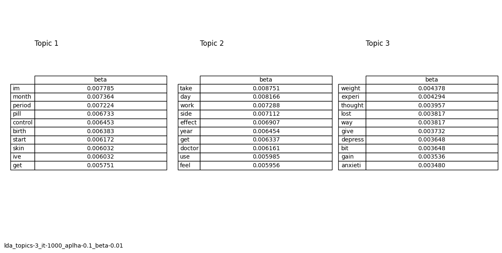

# Drug Reviews Clustering Using LDA

## Overview

This documentation provides a comprehensive guide to the data clustering process using `Latent Dirichlet Allocation` (LDA) on the dataset from the `KUC Hackathon Winter 2018`. Our objective is to replicate the topic assignment part of the paper "Machine learning in medicine: a practical introduction to natural language processing" using LDA.

which involves:

1. Cleaning the dataset in a manner consistent with the paper.
2. Creating a Document-Term Matrix (`DTM`) from the cleaned data.
3. Applying LDA using `Gibbs sampling` to discover the underlying topics.
4. Visualizing the results and comparing them with those reported in the paper.

By successfully replicating these steps, we aim to validate the findings of the original paper and gain a deeper understanding of the LDA algorithm and its application to NLP tasks.

## Problem Statement

Natural Language Processing (NLP) focuses on the interaction between computers and human language, enabling computers to understand, interpret, and generate human language. One significant challenge in NLP is extracting meaningful information from large and unstructured text datasets. Unsupervised learning, such as LDA, is crucial in this context as it does not require labeled training data, making it useful for exploratory data analysis and knowledge discovery.

LDA is a popular unsupervised learning algorithm used for topic modeling, identifying underlying themes or topics in a collection of documents. By analyzing the distribution of words across documents, LDA can infer the topics present in the text and assign probabilities to each word belonging to a particular topic.

## Parameters

The `simulation` exposes several parameters to the user that influence the clustering results. A sample configuration is provided in the `./config/config.yaml` file.

### Training Data parameters

1. `enable-caching` (default: `true`): This field specifies whether clean training data should be cached. Sometimes, the training data is already cleaned and stored in the cache directory. In such cases, we set this parameter to `true` to load the cached data. If the cache does not exist and this parameter is set to `true`, the data will be cleaned, and the results will be saved to a file in the `cache` directory. However, if this parameter is set to false, the uncleaned training data will be loaded and cleaned without saving the cleaned data to the cache directory.
2. `cache-dir-path` (default `./cache`) Cache directory path for cleaned training data.
3. Sampling:  
    3.1. `number` (default: `-1`): number of samples that we consider in dataset. The `-1` means all the data.

    3.2. `seed` (default: `42`): We do sampling based on this randomize seed.

### DTM parameters

1. `min-df-threshold` (default: `0.005`): with this threshold we are sure that we are dealing with important words.
words that are used less than %0.5 are removed from the columns of DTM.

### LDA parameters

1. `enable-traning` (default: `true`): This field specifies whether training should be done or not. There are times when we already have the model (stored in the models directory) and we just want to run the model and see the results, in this case we leave this part `false`. But if this part is `true`, model will be trained from the beginning.
2. `models-dir-path` (default `./models`): Models directory path to persist result of trained models as a pickle formated file.
3. `num_topics` (default: `3`): The number of clusters or topics to identify within the data.
4. `iterations` (default: `1000`): The number of iterations over each document.
5. `alpha` (default: `0.1`): A hyperparameter that influences the sparsity of the topic distribution over documents.
6. `beta` (default: `0.01`): A hyperparameter that plays a crucial role in shaping the topic distributions.
7. `seed` (default: `42`): The random seed to have predictable random sequences in entire fit process.

### Result parameters

1. `results-dir-path` (default `./results`): Results directory path to persist image of final tables as a png picture.
2. `top-words` (default: `10`): number of the words that we chose to show as result.

## Implementation

The clustering process using LDA involves several key steps:

1. Data Cleaning: The dataset is first cleaned and preprocessed. This includes handling missing values, `normalizing` numerical features, and `encoding` categorical variables. Detailed steps for data cleaning are provided below.

2. Tokenization and Vectorization: For LDA to work, the data needs to be tokenized and converted into a `bag-of-words` representation. This step involves transforming the data into a document-term matrix (`DTM`).

3. Model Training: The LDA model is trained using the preprocessed and vectorized data. During training, the model learns the distribution of topics across the documents and the distribution of words within each topic.

4. Cluster Assignment: Once the model is trained, each data point is assigned to a cluster based on the highest topic probability.

5. Evaluation and Interpretation: The resulting clusters are evaluated and interpreted to understand the latent patterns and themes within the data.

## Data Cleaning

The data cleaning process is a crucial step in preparing the dataset for LDA. This section describes the steps taken to clean the text data, as implemented in the provided Python method called `clean_text_df`.

### Steps in Data Cleaning

1. Stop Words Removal: The process begins by defining a set of English stop words using the `nltk.corpus` module. Stop words are common words that are usually removed from text data to focus on more meaningful words.

2. Lowercasing: All text is converted to lowercase using `df.str.lower()` to ensure uniformity, as text data can be case-sensitive.

3. Replacing HTML Entities: The HTML entity &#039; is replaced with an empty string using `str.replace()`. This step cleans up HTML artifacts in the text.

4. Removing Special Characters: All special characters are removed using a regular expression that matches non-word and non-whitespace characters.

5. Removing Non-ASCII Characters: Characters that are not part of the `ASCII` set are removed using a regular expression. This step ensures that the text contains only standard English characters.

6. Trimming Whitespace: Leading and trailing whitespace are removed using `str.replace()` with a regular expression.

7. Replacing Multiple Spaces: Multiple consecutive spaces are replaced with a single space to normalize spacing within the text.

8. Replacing Multiple Dots: Two or more consecutive dots are replaced with a single space. This handles ellipses and other punctuation issues.

9. Removing Numbers: Words containing numbers are removed using a regular expression that matches alphanumeric words.

10. Stop Words Removal: Each word in the text is checked against the set of stop words. Words that are in the stop words list are removed from the text.

11. Porter Stemming: The PorterStemmer from the `nltk.stem` module is used to stem words. Stemming reduces words to their root form, which helps in normalizing the text.

## Results

After running the LDA model with the above configurations, as described in the paper, the dataset will be clustered into three topics. Each topic represents a set of data points with similar attributes. The results can be used to draw insights and further analyze the underlying patterns within the dataset. Results are persisted in the `./results` directory and can be viewed in runs.



## Conclusion

This documentation provides a comprehensive simulation to do LDA for on `KUC Hackathon Winter 2018` dataset. By following the steps, users can replicate the clustering process, adjust parameters to fit their needs, and interpret the results to gain valuable insights from the data.

## To Run The Simulation

1. Machine dependencies
    - `python3`
    - `make`

    Note: `Linux` and `OSX` are the only two machines that this simulation has been tested on..

2. Run the main function

    ```bash
    make run-main
    ```

## To Run Unit Tests

```bash
make run-tests
```

## To Cleaup Environment

```bash
make cleanup
```

## To Simulate Different Configurations Using Config Files Other Than `./config/config.yaml`

1. Create your config file in a directory of your choice.
2. Modify the `main.py` to change the simulation or add a new one.
3. Run `make run-main` command to run tests and simulations.
